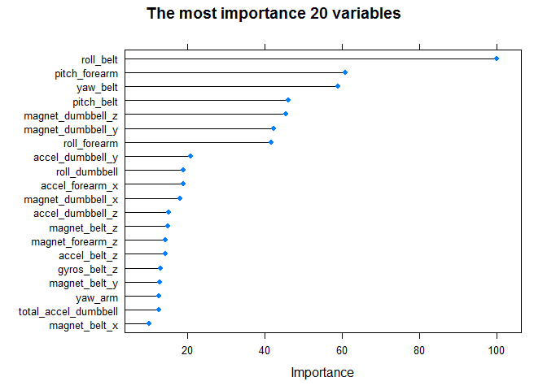

# Machine Learning final project
Han Zhang  
August 18, 2017  

## R Markdown

The goal of this project is to predict the manner in which human did the exercise. This is the "classe" variable in the training set. I built a random forest model to predict the "classe". I will also use the prediction model to predict 20 different test cases.


## Reading data and cleaning


```r
training_Url <- "https://d396qusza40orc.cloudfront.net/predmachlearn/pml-training.csv"
testing_Url <- "https://d396qusza40orc.cloudfront.net/predmachlearn/pml-testing.csv"
train <- read.csv(training_Url, header = T, na.strings = c("NA", "", "DIV/0!"))
test <- read.csv(testing_Url, header = T, na.strings = c("NA", "", "DIV/0!"))

# Summarize raw data
dim(train)
```

```
## [1] 19622   160
```

```r
dim(test)
```

```
## [1]  20 160
```

```r
# cleaning
train_1 <- train[,!apply(train, 2, function(x) {sum(is.na(x))>2500})]
test_1 <- test[,!apply(test, 2, function(x) {sum(is.na(x))>10})]
training <- train_1[, c(8:dim(train_1)[2])]
testing <- test_1[, c(8:dim(test_1)[2])]
summary(training)
```

```
##    roll_belt        pitch_belt          yaw_belt       total_accel_belt
##  Min.   :-28.90   Min.   :-55.8000   Min.   :-180.00   Min.   : 0.00   
##  1st Qu.:  1.10   1st Qu.:  1.7600   1st Qu.: -88.30   1st Qu.: 3.00   
##  Median :113.00   Median :  5.2800   Median : -13.00   Median :17.00   
##  Mean   : 64.41   Mean   :  0.3053   Mean   : -11.21   Mean   :11.31   
##  3rd Qu.:123.00   3rd Qu.: 14.9000   3rd Qu.:  12.90   3rd Qu.:18.00   
##  Max.   :162.00   Max.   : 60.3000   Max.   : 179.00   Max.   :29.00   
##   gyros_belt_x        gyros_belt_y       gyros_belt_z    
##  Min.   :-1.040000   Min.   :-0.64000   Min.   :-1.4600  
##  1st Qu.:-0.030000   1st Qu.: 0.00000   1st Qu.:-0.2000  
##  Median : 0.030000   Median : 0.02000   Median :-0.1000  
##  Mean   :-0.005592   Mean   : 0.03959   Mean   :-0.1305  
##  3rd Qu.: 0.110000   3rd Qu.: 0.11000   3rd Qu.:-0.0200  
##  Max.   : 2.220000   Max.   : 0.64000   Max.   : 1.6200  
##   accel_belt_x       accel_belt_y     accel_belt_z     magnet_belt_x  
##  Min.   :-120.000   Min.   :-69.00   Min.   :-275.00   Min.   :-52.0  
##  1st Qu.: -21.000   1st Qu.:  3.00   1st Qu.:-162.00   1st Qu.:  9.0  
##  Median : -15.000   Median : 35.00   Median :-152.00   Median : 35.0  
##  Mean   :  -5.595   Mean   : 30.15   Mean   : -72.59   Mean   : 55.6  
##  3rd Qu.:  -5.000   3rd Qu.: 61.00   3rd Qu.:  27.00   3rd Qu.: 59.0  
##  Max.   :  85.000   Max.   :164.00   Max.   : 105.00   Max.   :485.0  
##  magnet_belt_y   magnet_belt_z       roll_arm         pitch_arm      
##  Min.   :354.0   Min.   :-623.0   Min.   :-180.00   Min.   :-88.800  
##  1st Qu.:581.0   1st Qu.:-375.0   1st Qu.: -31.77   1st Qu.:-25.900  
##  Median :601.0   Median :-320.0   Median :   0.00   Median :  0.000  
##  Mean   :593.7   Mean   :-345.5   Mean   :  17.83   Mean   : -4.612  
##  3rd Qu.:610.0   3rd Qu.:-306.0   3rd Qu.:  77.30   3rd Qu.: 11.200  
##  Max.   :673.0   Max.   : 293.0   Max.   : 180.00   Max.   : 88.500  
##     yaw_arm          total_accel_arm  gyros_arm_x        gyros_arm_y     
##  Min.   :-180.0000   Min.   : 1.00   Min.   :-6.37000   Min.   :-3.4400  
##  1st Qu.: -43.1000   1st Qu.:17.00   1st Qu.:-1.33000   1st Qu.:-0.8000  
##  Median :   0.0000   Median :27.00   Median : 0.08000   Median :-0.2400  
##  Mean   :  -0.6188   Mean   :25.51   Mean   : 0.04277   Mean   :-0.2571  
##  3rd Qu.:  45.8750   3rd Qu.:33.00   3rd Qu.: 1.57000   3rd Qu.: 0.1400  
##  Max.   : 180.0000   Max.   :66.00   Max.   : 4.87000   Max.   : 2.8400  
##   gyros_arm_z       accel_arm_x       accel_arm_y      accel_arm_z     
##  Min.   :-2.3300   Min.   :-404.00   Min.   :-318.0   Min.   :-636.00  
##  1st Qu.:-0.0700   1st Qu.:-242.00   1st Qu.: -54.0   1st Qu.:-143.00  
##  Median : 0.2300   Median : -44.00   Median :  14.0   Median : -47.00  
##  Mean   : 0.2695   Mean   : -60.24   Mean   :  32.6   Mean   : -71.25  
##  3rd Qu.: 0.7200   3rd Qu.:  84.00   3rd Qu.: 139.0   3rd Qu.:  23.00  
##  Max.   : 3.0200   Max.   : 437.00   Max.   : 308.0   Max.   : 292.00  
##   magnet_arm_x     magnet_arm_y     magnet_arm_z    roll_dumbbell    
##  Min.   :-584.0   Min.   :-392.0   Min.   :-597.0   Min.   :-153.71  
##  1st Qu.:-300.0   1st Qu.:  -9.0   1st Qu.: 131.2   1st Qu.: -18.49  
##  Median : 289.0   Median : 202.0   Median : 444.0   Median :  48.17  
##  Mean   : 191.7   Mean   : 156.6   Mean   : 306.5   Mean   :  23.84  
##  3rd Qu.: 637.0   3rd Qu.: 323.0   3rd Qu.: 545.0   3rd Qu.:  67.61  
##  Max.   : 782.0   Max.   : 583.0   Max.   : 694.0   Max.   : 153.55  
##  pitch_dumbbell     yaw_dumbbell      total_accel_dumbbell
##  Min.   :-149.59   Min.   :-150.871   Min.   : 0.00       
##  1st Qu.: -40.89   1st Qu.: -77.644   1st Qu.: 4.00       
##  Median : -20.96   Median :  -3.324   Median :10.00       
##  Mean   : -10.78   Mean   :   1.674   Mean   :13.72       
##  3rd Qu.:  17.50   3rd Qu.:  79.643   3rd Qu.:19.00       
##  Max.   : 149.40   Max.   : 154.952   Max.   :58.00       
##  gyros_dumbbell_x    gyros_dumbbell_y   gyros_dumbbell_z 
##  Min.   :-204.0000   Min.   :-2.10000   Min.   : -2.380  
##  1st Qu.:  -0.0300   1st Qu.:-0.14000   1st Qu.: -0.310  
##  Median :   0.1300   Median : 0.03000   Median : -0.130  
##  Mean   :   0.1611   Mean   : 0.04606   Mean   : -0.129  
##  3rd Qu.:   0.3500   3rd Qu.: 0.21000   3rd Qu.:  0.030  
##  Max.   :   2.2200   Max.   :52.00000   Max.   :317.000  
##  accel_dumbbell_x  accel_dumbbell_y  accel_dumbbell_z  magnet_dumbbell_x
##  Min.   :-419.00   Min.   :-189.00   Min.   :-334.00   Min.   :-643.0   
##  1st Qu.: -50.00   1st Qu.:  -8.00   1st Qu.:-142.00   1st Qu.:-535.0   
##  Median :  -8.00   Median :  41.50   Median :  -1.00   Median :-479.0   
##  Mean   : -28.62   Mean   :  52.63   Mean   : -38.32   Mean   :-328.5   
##  3rd Qu.:  11.00   3rd Qu.: 111.00   3rd Qu.:  38.00   3rd Qu.:-304.0   
##  Max.   : 235.00   Max.   : 315.00   Max.   : 318.00   Max.   : 592.0   
##  magnet_dumbbell_y magnet_dumbbell_z  roll_forearm       pitch_forearm   
##  Min.   :-3600     Min.   :-262.00   Min.   :-180.0000   Min.   :-72.50  
##  1st Qu.:  231     1st Qu.: -45.00   1st Qu.:  -0.7375   1st Qu.:  0.00  
##  Median :  311     Median :  13.00   Median :  21.7000   Median :  9.24  
##  Mean   :  221     Mean   :  46.05   Mean   :  33.8265   Mean   : 10.71  
##  3rd Qu.:  390     3rd Qu.:  95.00   3rd Qu.: 140.0000   3rd Qu.: 28.40  
##  Max.   :  633     Max.   : 452.00   Max.   : 180.0000   Max.   : 89.80  
##   yaw_forearm      total_accel_forearm gyros_forearm_x  
##  Min.   :-180.00   Min.   :  0.00      Min.   :-22.000  
##  1st Qu.: -68.60   1st Qu.: 29.00      1st Qu.: -0.220  
##  Median :   0.00   Median : 36.00      Median :  0.050  
##  Mean   :  19.21   Mean   : 34.72      Mean   :  0.158  
##  3rd Qu.: 110.00   3rd Qu.: 41.00      3rd Qu.:  0.560  
##  Max.   : 180.00   Max.   :108.00      Max.   :  3.970  
##  gyros_forearm_y     gyros_forearm_z    accel_forearm_x   accel_forearm_y 
##  Min.   : -7.02000   Min.   : -8.0900   Min.   :-498.00   Min.   :-632.0  
##  1st Qu.: -1.46000   1st Qu.: -0.1800   1st Qu.:-178.00   1st Qu.:  57.0  
##  Median :  0.03000   Median :  0.0800   Median : -57.00   Median : 201.0  
##  Mean   :  0.07517   Mean   :  0.1512   Mean   : -61.65   Mean   : 163.7  
##  3rd Qu.:  1.62000   3rd Qu.:  0.4900   3rd Qu.:  76.00   3rd Qu.: 312.0  
##  Max.   :311.00000   Max.   :231.0000   Max.   : 477.00   Max.   : 923.0  
##  accel_forearm_z   magnet_forearm_x  magnet_forearm_y magnet_forearm_z
##  Min.   :-446.00   Min.   :-1280.0   Min.   :-896.0   Min.   :-973.0  
##  1st Qu.:-182.00   1st Qu.: -616.0   1st Qu.:   2.0   1st Qu.: 191.0  
##  Median : -39.00   Median : -378.0   Median : 591.0   Median : 511.0  
##  Mean   : -55.29   Mean   : -312.6   Mean   : 380.1   Mean   : 393.6  
##  3rd Qu.:  26.00   3rd Qu.:  -73.0   3rd Qu.: 737.0   3rd Qu.: 653.0  
##  Max.   : 291.00   Max.   :  672.0   Max.   :1480.0   Max.   :1090.0  
##  classe  
##  A:5580  
##  B:3797  
##  C:3422  
##  D:3216  
##  E:3607  
## 
```


## Data preprocessing


```r
library(caret)
```

```
## Loading required package: lattice
```

```
## Loading required package: ggplot2
```

```
## Warning: package 'ggplot2' was built under R version 3.3.3
```

```r
library(rattle)
```

```
## Rattle: A free graphical interface for data mining with R.
## XXXX 4.1.0 Copyright (c) 2006-2015 Togaware Pty Ltd.
## Type 'rattle()' to shake, rattle, and roll your data.
```

```r
library(randomForest)
```

```
## randomForest 4.6-12
```

```
## Type rfNews() to see new features/changes/bug fixes.
```

```
## 
## Attaching package: 'randomForest'
```

```
## The following object is masked from 'package:ggplot2':
## 
##     margin
```

```r
library(survival)
```

```
## 
## Attaching package: 'survival'
```

```
## The following object is masked from 'package:caret':
## 
##     cluster
```

```r
preobj <- preProcess(training[, 1:52], method = c("center", "scale", "knnImpute"))
newtrain <- predict(preobj, training[, c(1:52)])
newtrain$classe <- training$classe
newtest <- predict(preobj, testing[, c(1:52)])
newtest$problem_id <- testing$problem_id

inTrain <- createDataPartition(y = newtrain$classe, p=0.7, list = F)
train_Train <- newtrain[inTrain,]
train_Test <- newtrain[-inTrain,]
```


## Random Forest Model

# Since Random Forest model is great for dealing with category prediction questions, here I use it first to build a model. 70% of training data was used to build the model and cross validation was used in the model to avoid overfitting. The model was tested on another 30% training data to check the performance.


```r
set.seed(12345)
modelfit1 <- train(classe~., data=train_Train, method="rf", trControl=trainControl(method="repeatedcv", number=5, repeats=3))
plot(varImp(modelfit1), top=20,  main="The most importance 20 variables")
```

<!-- -->
# Data validation on RF Model


```r
pred_1 <- predict(modelfit1, newdata=train_Test[, 1:52])
confusionMatrix(pred_1, train_Test$classe)
```

```
## Confusion Matrix and Statistics
## 
##           Reference
## Prediction    A    B    C    D    E
##          A 1673    2    0    0    0
##          B    1 1133   10    1    0
##          C    0    4 1009   15    0
##          D    0    0    7  947    2
##          E    0    0    0    1 1080
## 
## Overall Statistics
##                                           
##                Accuracy : 0.9927          
##                  95% CI : (0.9902, 0.9947)
##     No Information Rate : 0.2845          
##     P-Value [Acc > NIR] : < 2.2e-16       
##                                           
##                   Kappa : 0.9908          
##  Mcnemar's Test P-Value : NA              
## 
## Statistics by Class:
## 
##                      Class: A Class: B Class: C Class: D Class: E
## Sensitivity            0.9994   0.9947   0.9834   0.9824   0.9982
## Specificity            0.9995   0.9975   0.9961   0.9982   0.9998
## Pos Pred Value         0.9988   0.9895   0.9815   0.9906   0.9991
## Neg Pred Value         0.9998   0.9987   0.9965   0.9966   0.9996
## Prevalence             0.2845   0.1935   0.1743   0.1638   0.1839
## Detection Rate         0.2843   0.1925   0.1715   0.1609   0.1835
## Detection Prevalence   0.2846   0.1946   0.1747   0.1624   0.1837
## Balanced Accuracy      0.9995   0.9961   0.9898   0.9903   0.9990
```
The model showed great accuracy (99.2%), so the out of sample error = 1 - accuracy = 0.8%. Since the random forest model give great performance, so I will use this model to predict the testing dataset.


## Apply model1 to validation dataset


```r
prediction <- predict(modelfit1, newdata=newtest[, 1:52])
```

## Conclusion

The ConfusionMatrix achieved more than 99% sensitivity and specificity  and only 0.8% out of sample error. This model was great for the final prediction The prediction for validation data No.1-20 were:


```r
prediction
```

```
##  [1] B A B A A E D B A A B C B A E E A B B B
## Levels: A B C D E
```
